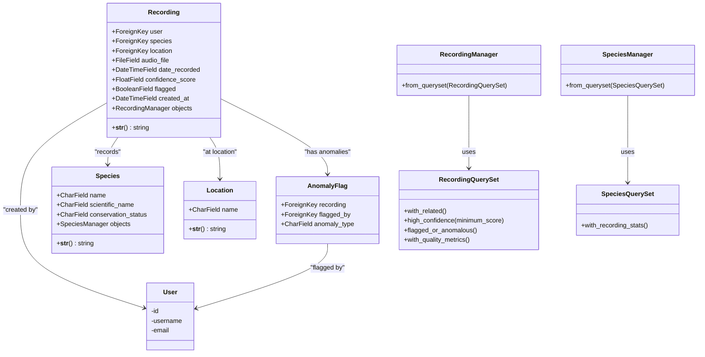

# Class Diagram

```mermaid
classDiagram
    class Species {
        +CharField name
        +CharField scientific_name
        +CharField conservation_status
        +SpeciesManager objects
        +__str__() string
    }

    class Location {
        +CharField name
        +__str__() string
    }

    class Recording {
        +ForeignKey user
        +ForeignKey species
        +ForeignKey location
        +FileField audio_file
        +DateTimeField date_recorded
        +FloatField confidence_score
        +BooleanField flagged
        +DateTimeField created_at
        +RecordingManager objects
        +__str__() string
    }

    class AnomalyFlag {
        +ForeignKey recording
        +ForeignKey flagged_by
        +CharField anomaly_type
    }

    class RecordingQuerySet {
        +with_related()
        +high_confidence(minimum_score)
        +flagged_or_anomalous()
        +with_quality_metrics()
    }

    class RecordingManager {
        +from_queryset(RecordingQuerySet)
    }

    class SpeciesQuerySet {
        +with_recording_stats()
    }

    class SpeciesManager {
        +from_queryset(SpeciesQuerySet)
    }

    class User {
        -id
        -username
        -email
    }

    Recording --> User : "created by"
    Recording --> Species : "records"
    Recording --> Location : "at location"
    Recording --> AnomalyFlag : "has anomalies"
    AnomalyFlag --> User : "flagged by"
    RecordingManager --> RecordingQuerySet : uses
    SpeciesManager --> SpeciesQuerySet : uses
```
