# Class Diagram

Covers all four architectural layers: data models with custom managers/querysets, the access-control policy, the service layer, the view layer, and the custom exception hierarchy.

```mermaid
classDiagram

    %% ── DJANGO AUTH ─────────────────────────────────────────────────────────
    class User {
        <<Django Auth>>
        +int id
        +str username
        +str email
        +str password
        +bool is_superuser
        +bool is_authenticated
    }

    class Group {
        <<Django Auth>>
        +int id
        +str name
    }

    class Permission {
        <<Django Auth>>
        +int id
        +str codename
        +str name
    }

    %% ── DATA MODELS ─────────────────────────────────────────────────────────
    class Species {
        +int id
        +str name
        +str scientific_name
        +str conservation_status
        +SpeciesManager objects
        +__str__() str
        META permissions: view_species_analytics
    }

    class Location {
        +int id
        +str name
        +__str__() str
    }

    class Recording {
        +int id
        +int user_id
        +int species_id
        +int location_id
        +FileField audio_file
        +datetime date_recorded
        +float confidence_score
        +bool flagged
        +datetime created_at
        +RecordingManager objects
        +__str__() str
        META permissions: view_all_recordings, review_recordings
    }

    class AnomalyFlag {
        +int id
        +int recording_id
        +int flagged_by_id
        +str anomaly_type
        +str description
        +datetime flagged_at
        +__str__() str
        META permissions: view_all_anomaly_flags
    }

    %% ── MANAGERS AND QUERYSETS ──────────────────────────────────────────────
    class SpeciesQuerySet {
        <<QuerySet>>
        +with_recording_stats() QuerySet
    }

    class SpeciesManager {
        <<Manager>>
        +from_queryset(SpeciesQuerySet)
    }

    class RecordingQuerySet {
        <<QuerySet>>
        +with_related() QuerySet
        +high_confidence(minimum_score) QuerySet
        +flagged_or_anomalous() QuerySet
        +with_quality_metrics() QuerySet
    }

    class RecordingManager {
        <<Manager>>
        +from_queryset(RecordingQuerySet)
    }

    %% ── AUTHORIZATION LAYER ─────────────────────────────────────────────────
    class RecordingAccessPolicy {
        <<Policy>>
        +str VIEW_ALL_PERMISSION
        +str REVIEW_PERMISSION
        +str ANALYTICS_PERMISSION
        +_is_authenticated(user) bool
        +can_create_recording(user) bool
        +can_flag_recording(user) bool
        +can_review_recordings(user) bool
        +can_view_all_recordings(user) bool
        +can_view_analytics(user) bool
        +scope_recordings_queryset(user, queryset) QuerySet
    }

    %% ── SERVICE LAYER ───────────────────────────────────────────────────────
    class RecordingServices {
        <<Service>>
        +submit_recording(user, species_id, location_id, audio_file, date_recorded, confidence_score) Recording
        +flag_recording(user, recording_id, anomaly_type, description) AnomalyFlag
        +review_recording(user, recording_id) Recording
    }

    %% ── VIEW LAYER ──────────────────────────────────────────────────────────
    class RecordingQuerysetMixin {
        <<Mixin>>
        +get_base_queryset() QuerySet
        +get_authorized_queryset() QuerySet
    }

    class RecordingListView {
        +get(request) HttpResponse
    }

    class RecordingDetailView {
        +get(request, pk) HttpResponse
    }

    class RecordingCreateView {
        +get(request) HttpResponse
        +post(request) HttpResponse
    }

    class FlagRecordingView {
        +post(request, pk) HttpResponse
    }

    class ReviewRecordingView {
        +post(request, pk) HttpResponse
    }

    class SpeciesAnalyticsView {
        +get(request) HttpResponse
    }

    class RegisterView {
        +get(request) HttpResponse
        +post(request) HttpResponse
    }

    class RecordingDeleteView {
        +post(request, pk) HttpResponse
    }

    %% ── EXCEPTION HIERARCHY ─────────────────────────────────────────────────
    class BlogAppException {
        <<Exception>>
        +str message
        +str error_code
        +int http_status_code
        +dict details
        +to_dict() dict
    }

    class RecordingException {
        <<Exception>>
        error_code = RECORDING_ERROR
    }

    class RecordingNotFound {
        <<Exception>>
        error_code = RECORDING_NOT_FOUND
        http_status_code = 404
    }

    class RecordingValidationError {
        <<Exception>>
        error_code = RECORDING_VALIDATION_ERROR
        http_status_code = 400
    }

    class InvalidConfidenceScore {
        <<Exception>>
        error_code = INVALID_CONFIDENCE_SCORE
    }

    class SpeciesException {
        <<Exception>>
        error_code = SPECIES_ERROR
    }

    class SpeciesNotFound {
        <<Exception>>
        error_code = SPECIES_NOT_FOUND
        http_status_code = 404
    }

    class LocationException {
        <<Exception>>
        error_code = LOCATION_ERROR
    }

    class LocationNotFound {
        <<Exception>>
        error_code = LOCATION_NOT_FOUND
        http_status_code = 404
    }

    class FormException {
        <<Exception>>
        error_code = FORM_ERROR
        http_status_code = 400
    }

    class InvalidFormData {
        <<Exception>>
        error_code = INVALID_FORM_DATA
    }

    class FileUploadError {
        <<Exception>>
        error_code = FILE_UPLOAD_ERROR
    }

    %% ── DJANGO AUTH RELATIONSHIPS ────────────────────────────────────────────
    User "*" -- "*" Group : belongs to
    User "*" -- "*" Permission : has directly
    Group "*" -- "*" Permission : has

    %% ── DATA MODEL RELATIONSHIPS ─────────────────────────────────────────────
    User "1" --> "*" Recording : creates
    User "1" --> "*" AnomalyFlag : flags
    Species "1" --> "*" Recording : recorded as
    Location "1" --> "*" Recording : recorded at
    Recording "1" --> "*" AnomalyFlag : has

    %% ── MANAGER / QUERYSET ───────────────────────────────────────────────────
    Species --> SpeciesManager : objects
    SpeciesManager --> SpeciesQuerySet : wraps
    Recording --> RecordingManager : objects
    RecordingManager --> RecordingQuerySet : wraps

    %% ── AUTHORIZATION ────────────────────────────────────────────────────────
    RecordingAccessPolicy ..> User : inspects permissions
    RecordingAccessPolicy ..> Permission : checks codenames
    RecordingAccessPolicy ..> RecordingQuerySet : scopes

    %% ── SERVICE DEPENDENCIES ─────────────────────────────────────────────────
    RecordingServices ..> RecordingAccessPolicy : enforces via
    RecordingServices ..> Recording : creates / updates
    RecordingServices ..> AnomalyFlag : creates / deletes
    RecordingServices ..> Species : validates
    RecordingServices ..> Location : validates
    RecordingServices ..> BlogAppException : raises

    %% ── VIEW INHERITANCE AND DEPENDENCIES ────────────────────────────────────
    RecordingListView --|> RecordingQuerysetMixin
    RecordingDetailView --|> RecordingQuerysetMixin
    RecordingQuerysetMixin ..> RecordingAccessPolicy : delegates to
    RecordingCreateView ..> RecordingServices : submit_recording
    FlagRecordingView ..> RecordingServices : flag_recording
    ReviewRecordingView ..> RecordingServices : review_recording
    SpeciesAnalyticsView ..> RecordingAccessPolicy : can_view_analytics

    %% ── EXCEPTION INHERITANCE ────────────────────────────────────────────────
    BlogAppException <|-- RecordingException
    BlogAppException <|-- SpeciesException
    BlogAppException <|-- LocationException
    BlogAppException <|-- FormException
    RecordingException <|-- RecordingNotFound
    RecordingException <|-- RecordingValidationError
    RecordingValidationError <|-- InvalidConfidenceScore
    SpeciesException <|-- SpeciesNotFound
    LocationException <|-- LocationNotFound
    FormException <|-- InvalidFormData
    FormException <|-- FileUploadError
```

