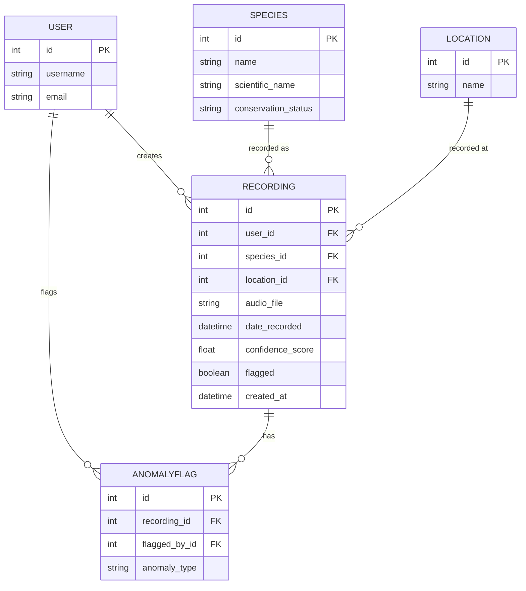

# Entity Relationship Diagram (ERD)

```mermaid
erDiagram
    USER ||--o{ RECORDING : creates
    USER ||--o{ ANOMALYFLAG : flags
    SPECIES ||--o{ RECORDING : "recorded as"
    LOCATION ||--o{ RECORDING : "recorded at"
    RECORDING ||--o{ ANOMALYFLAG : has

    SPECIES {
        int id PK
        string name
        string scientific_name
        string conservation_status
    }

    LOCATION {
        int id PK
        string name
    }

    RECORDING {
        int id PK
        int user_id FK
        int species_id FK
        int location_id FK
        string audio_file
        datetime date_recorded
        float confidence_score
        boolean flagged
        datetime created_at
    }

    ANOMALYFLAG {
        int id PK
        int recording_id FK
        int flagged_by_id FK
        string anomaly_type
    }

    USER {
        int id PK
        string username
        string email
    }
```
