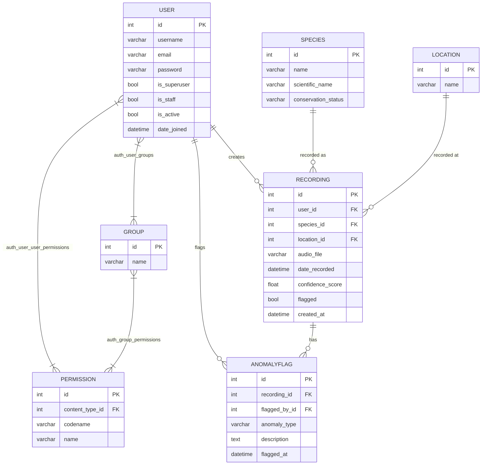

# Entity Relationship Diagram (ERD)

Includes the application tables and the Django auth tables that back role-based access control (Users → Groups → Permissions). Custom permissions (`view_all_recordings`, `review_recordings`, `view_species_analytics`, `view_all_anomaly_flags`) are stored as rows in `auth_permission` and linked to users/groups through the standard Django many-to-many join tables.

