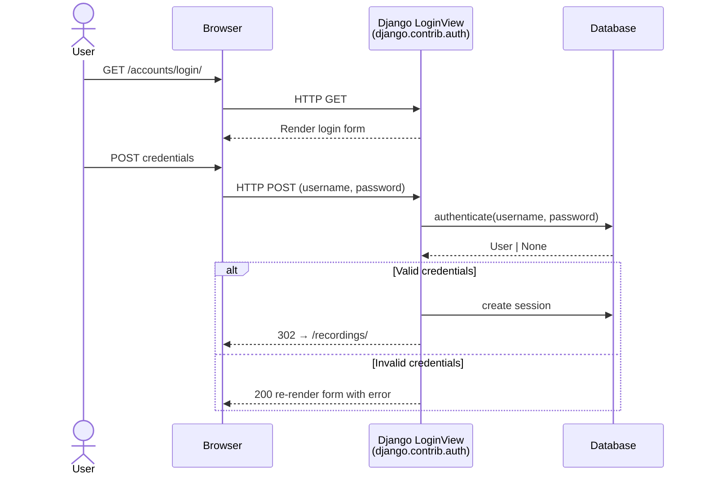
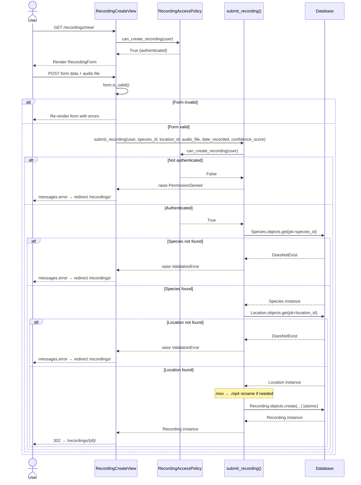
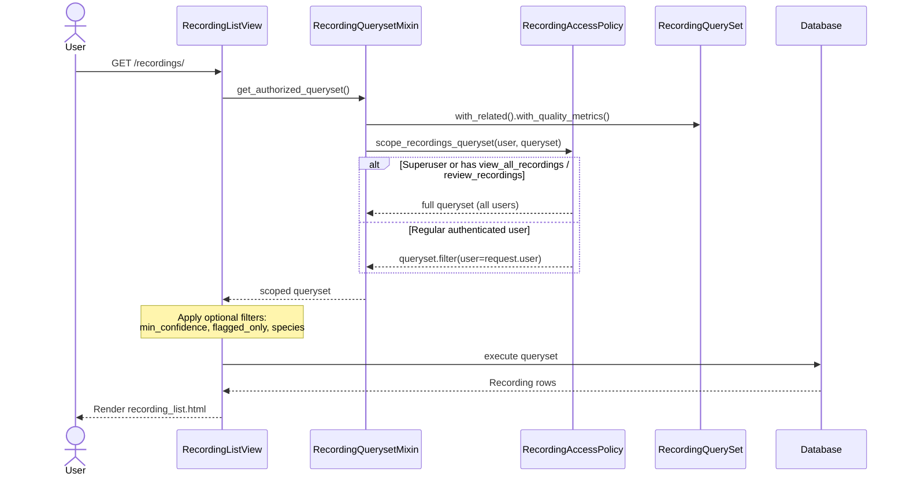
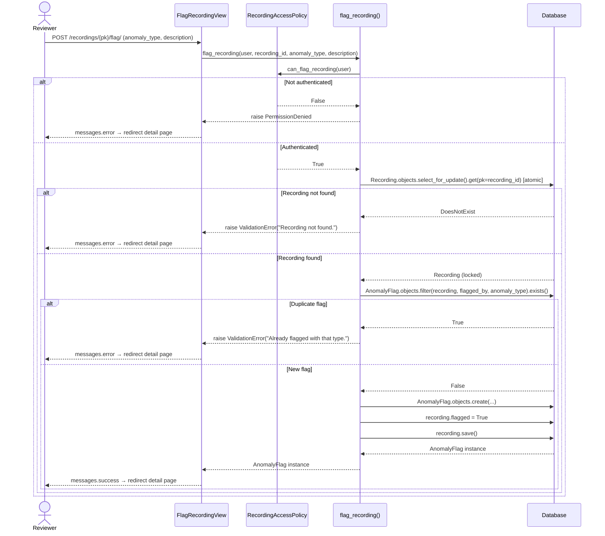
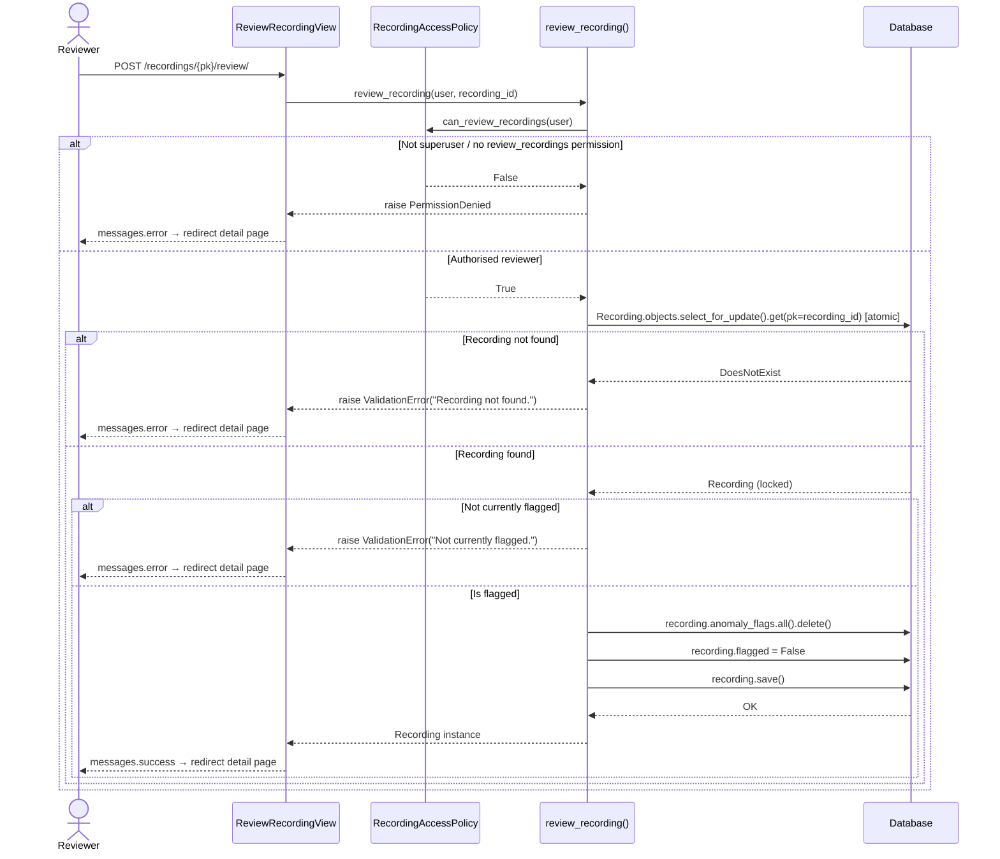

# Sequence Diagrams

Covers the five primary user flows: authentication, recording submission, recording list (with authorization scoping), anomaly flagging, and reviewer sign-off.

---

## 1. User Login

---

## 2. Submit Recording

---

## 3. View Recordings List (with Authorization Scoping)

---

## 4. Flag a Recording (Anomaly Report)

---

## 5. Review a Recording (Clear Flags)

